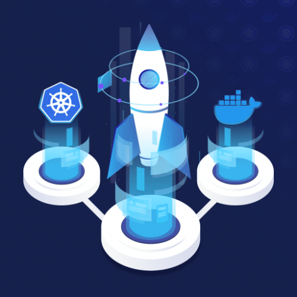

<a name="readme-top"></a>

<!-- PROJECT SHIELDS -->
[![Contributors][contributors-shield]][contributors-url]
[![Forks][forks-shield]][forks-url]
[![Stargazers][stars-shield]][stars-url]
[![Issues][issues-shield]][issues-url]
[![MIT License][license-shield]][license-url]
[![LinkedIn][linkedin-shield]][linkedin-url]

<!-- PROJECT LOGO -->
<br />
<div align="center">
  <a href="https://github.com/jamestkelly/K8s-PySpark-Matrix">
    
  </a>

<h3 align="center">K8s PySpark Matrix</h3>

  <p align="center">
    A proof of concept (POC) project for performing PySpark operations using Kubernetes as accessed via an exposed API end-point.
    <br />
    <a href="https://github.com/jamestkelly/K8s-PySpark-Matrix"><strong>Explore the docs »</strong></a>
    <br />
    <br />
    <a href="https://github.com/jamestkelly/K8s-PySpark-Matrix">View Demo</a>
    ·
    <a href="https://github.com/jamestkelly/K8s-PySpark-Matrix/issues">Report Bug</a>
    ·
    <a href="https://github.com/jamestkelly/K8s-PySpark-Matrix/issues">Request Feature</a>
  </p>
</div>


<!-- TABLE OF CONTENTS -->
<details>
  <summary>Table of Contents</summary>
  <ol>
    <li>
      <a href="#about-the-project">About The Project</a>
      <ul>
        <li><a href="#built-with">Built With</a></li>
      </ul>
    </li>
    <li>
      <a href="#getting-started">Getting Started</a>
      <ul>
        <li><a href="#prerequisites">Prerequisites</a></li>
        <li><a href="#installation">Installation</a></li>
      </ul>
    </li>
    <li><a href="#usage">Usage</a></li>
    <li><a href="#roadmap">Roadmap</a></li>
    <li><a href="#contributing">Contributing</a></li>
    <li><a href="#license">License</a></li>
    <li><a href="#contact">Contact</a></li>
    <li><a href="#acknowledgments">Acknowledgments</a></li>
  </ol>
</details>


<!-- ABOUT THE PROJECT -->
## About The Project

[![Product Name Screen Shot][product-screenshot]](https://example.com)

This project is a proof of concept (POC) for the implementation of a Python Flask API that utilises PySpark for data jobs within Kubernetes.

The application's core functionality is relatively simple, predominantly that of a health-checker to validate the API is live and running, and a basic matrix multiplication performed in PySpark.

<p align="right">(<a href="#readme-top">back to top</a>)</p>

### Built With

* [![Python][Python.org]][Python-url]
* [![Flask][Flask.io]][Flask-url]
* [![Apache Spark][ApacheSpark.org]][ApacheSpark-url]
* [![Docker][Docker.com]][Docker-url]
* [![Kubernetes][Kubernetes.io]][Kubernetes-url]

<p align="right">(<a href="#readme-top">back to top</a>)</p>

<!-- GETTING STARTED -->
## Getting Started

This is an example of how you may give instructions on setting up your project locally.
To get a local copy up and running follow these simple example steps.

### Prerequisites

This is an example of how to list things you need to use the software and how to install them.
* npm
  ```sh
  npm install npm@latest -g
  ```

### Installation

1. Get a free API Key at [https://example.com](https://example.com)
2. Clone the repo
   ```sh
   git clone https://github.com/jamestkelly/K8s-PySpark-Matrix.git
   ```
3. Install NPM packages
   ```sh
   npm install
   ```
4. Enter your API in `config.js`
   ```js
   const API_KEY = 'ENTER YOUR API';
   ```

<p align="right">(<a href="#readme-top">back to top</a>)</p>

<!-- USAGE EXAMPLES -->
## Usage

Use this space to show useful examples of how a project can be used. Additional screenshots, code examples and demos work well in this space. You may also link to more resources.

_For more examples, please refer to the [Documentation](https://example.com)_

<p align="right">(<a href="#readme-top">back to top</a>)</p>

<!-- ROADMAP -->
## Roadmap

- [X] Initial build of standard Python Flask RESTful API
- [X] Dockerisation of application
- [X] Kubernetes integration
- [ ] PySpark integration
    - [ ] Matrix multiplication
    - [ ] Fast Fourier Transform (FFT)
- [ ] Finalisation of documentation
  - [ ] Thorough commenting of code where needed
  - [ ] Completion of `README.md` with usage and installation information
- [ ] API server public hosting on a cloud platform, e.g., AWS.

See the [open issues](https://github.com/jamestkelly/K8s-PySpark-Matrix/issues) for a full list of proposed features (and known issues).

<p align="right">(<a href="#readme-top">back to top</a>)</p>

<!-- CONTRIBUTING -->
## Contributing

Contributions are what make the open source community such an amazing place to learn, inspire, and create. Any contributions you make are **greatly appreciated**.

If you have a suggestion that would make this better, please fork the repo and create a pull request. You can also simply open an issue with the tag "enhancement".
Don't forget to give the project a star! Thanks again!

1. Fork the Project
2. Create your Feature Branch (`git checkout -b feature/AmazingFeature`)
3. Commit your Changes (`git commit -m 'Add some AmazingFeature'`)
4. Push to the Branch (`git push origin feature/AmazingFeature`)
5. Open a Pull Request

<p align="right">(<a href="#readme-top">back to top</a>)</p>

<!-- LICENSE -->
## License

Distributed under the MIT License. See `LICENSE.txt` for more information.

<p align="right">(<a href="#readme-top">back to top</a>)</p>

<!-- CONTACT -->
## Contact

Jim Kelly - jimkelly.t@outlook.com

Project Link: [https://github.com/jamestkelly/K8s-PySpark-Matrix](https://github.com/jamestkelly/K8s-PySpark-Matrix)

<p align="right">(<a href="#readme-top">back to top</a>)</p>

<!-- ACKNOWLEDGMENTS -->
## Acknowledgments

* [Get started with Kubernetes (using Python)](https://kubernetes.io/blog/2019/07/23/get-started-with-kubernetes-using-python/)
* [Deploy on Kubernetes | Docker Documentation](https://docs.docker.com/desktop/kubernetes/)

<p align="right">(<a href="#readme-top">back to top</a>)</p>

<!-- MARKDOWN LINKS & IMAGES -->
<!-- Shields taken from https://ileriayo.github.io/markdown-badges/ -->
[contributors-shield]: https://img.shields.io/github/contributors/jamestkelly/K8s-PySpark-Matrix.svg?style=for-the-badge
[contributors-url]: https://github.com/jamestkelly/K8s-PySpark-Matrix/graphs/contributors
[forks-shield]: https://img.shields.io/github/forks/jamestkelly/K8s-PySpark-Matrix.svg?style=for-the-badge
[forks-url]: https://github.com/jamestkelly/K8s-PySpark-Matrix/network/members
[stars-shield]: https://img.shields.io/github/stars/jamestkelly/K8s-PySpark-Matrix.svg?style=for-the-badge
[stars-url]: https://github.com/jamestkelly/K8s-PySpark-Matrix/stargazers
[issues-shield]: https://img.shields.io/github/issues/jamestkelly/K8s-PySpark-Matrix.svg?style=for-the-badge
[issues-url]: https://github.com/jamestkelly/K8s-PySpark-Matrix/issues
[license-shield]: https://img.shields.io/github/license/jamestkelly/K8s-PySpark-Matrix.svg?style=for-the-badge
[license-url]: https://github.com/jamestkelly/K8s-PySpark-Matrix/blob/master/LICENSE.txt
[linkedin-shield]: https://img.shields.io/badge/-LinkedIn-black.svg?style=for-the-badge&logo=linkedin&colorB=555
[linkedin-url]: https://linkedin.com/in/jimkellyt
[product-screenshot]: resources/img/matrix_multiplication.png
[Python.org]: https://img.shields.io/badge/Python-3776AB?style=for-the-badge&logo=python&logoColor=white
[Python-url]: https://www.python.org
[Kubernetes.io]:https://img.shields.io/badge/kubernetes-%23326ce5.svg?style=for-the-badge&logo=kubernetes&logoColor=white
[Kubernetes-url]:https://kubernetes.io
[Docker.com]:https://img.shields.io/badge/docker-%230db7ed.svg?style=for-the-badge&logo=docker&logoColor=white
[Docker-url]:https://www.docker.com
[Flask.io]:https://img.shields.io/badge/flask-%23000.svg?style=for-the-badge&logo=flask&logoColor=white
[Flask-url]:https://flask.palletsprojects.com/en/2.3.x/
[ApacheSpark.org]:https://img.shields.io/badge/Apache%20Spark-FDEE21?style=flat-square&logo=apachespark&logoColor=black
[ApacheSpark-url]:https://spark.apache.org
